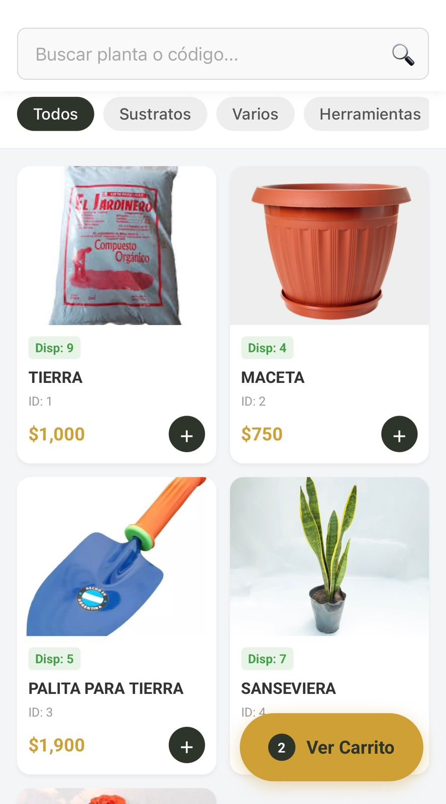
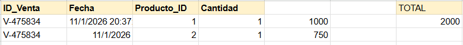

# Sistema de Gestión de Stock y Ventas - Vivero La Galería 🌿

Este proyecto es una solución Full Stack para la gestión de inventario en tiempo real de un vivero. Conecta una base de datos en Google Sheets con dos interfaces: una Web App para el vendedor (POS) y una Web pública para los clientes.

## 🚀 Características
* **Base de Datos en Tiempo Real:** Google Sheets actúa como DB centralizada.
* **Punto de Venta (POS):** Web App (Google Apps Script) con autenticación por PIN, escáner de stock y carrito de compras.
* **Control de Stock:** Bloqueo automático de ventas si no hay stock suficiente.
* **Sincronización:** La página web pública oculta automáticamente productos agotados.

## 🛠 Tecnologías Usadas
* **Frontend:** HTML5, CSS3, JavaScript (Vanilla).
* **Backend/Serverless:** Google Apps Script.
* **Base de Datos:** Google Sheets.

## 📸 Capturas

## 🔗 Demo
* [Ver código fuente Backend](./backend-appscript/Codigo.gs)
* [Ver sitio web del cliente](LINK_DE_TU_PAGINA_WEB_PUBLICA)
